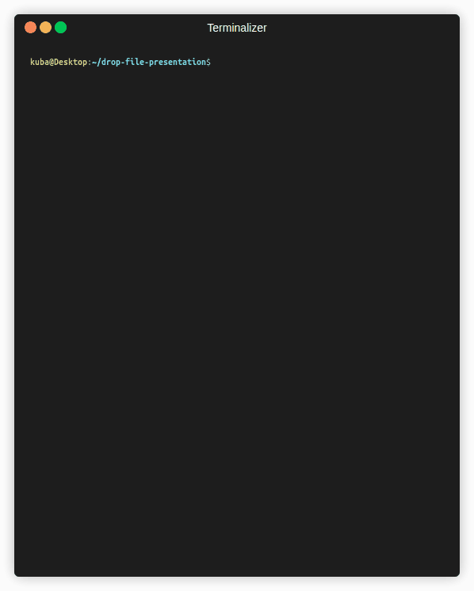
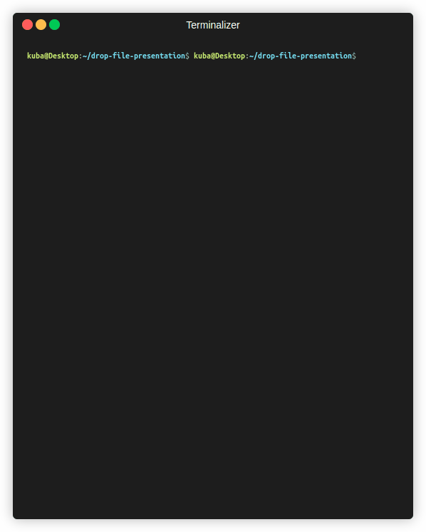

# Drop File

## Introduction
Drop File is my C++ implementation inspired by the popular open-source project [magic-wormhole](https://github.com/magic-wormhole/magic-wormhole). 
This tool enables the secure transfer of files between two devices using drop-file-server. 
The communication is encrypted, and the server can be self-hosted and launched in a Docker container.
I hosted the server under `mydomain` domain, which is also the default domain set in client. Default drop-file project port is 8088.

## Table of Contents
- [Introduction](#introduction)
- [Features](#features)
- [Installation](#installation)
- [Usage](#usage)
- [Self-hosted](#Self-hosted)
- [Dependencies](#dependencies)
- [Examples](#examples)
- [License](#license)

## Features
- Secure file transfer
- Encrypted communication
- Public server accessible anywhere, but can be self-hosted too
- Docker support
- Proxy server architecture (clients do not directly communicate)

## Installation
To run drop-file client, you need to clone the repository and set up the environment and compile the project.

```bash
git clone https://github.com/Erionn02/drop-file.git
cd drop-file
./setup.sh
mkdir -p build && cd build && \
    cmake -DCMAKE_BUILD_TYPE=Release .. && cmake --build . -t drop-file -- -j $(nproc --all)
sudo cp drop-file /usr/bin
```

## Usage
Drop File consists of a server and a client application. The server manages file transfer requests
and clients connect to the server to either send or receive files.

Sender          |  Receiver
:-------------------------:|:-------------------------:
  |  
 

## Self-hosted
If you want to host this server just for yourself, you are free to do so.
Just install docker, build image, and you are good to go:

### Building image:
```bash
cd drop-file
docker build -t drop-file-server -f ./Dockerfile .
```
### Running the server:
Here you can use the default drop-file-server port. You can change the port by adding `-p <your_port>` as `drop-file-server's` arg.
Remember to also change the container port bindings.
Also, remember to use your own key and certificate, by providing path to the directory containing `key.pem` and `cert.pem` files.
```bash
docker run -p 8088:8088 -v <path_to_your_certs>:/certs_dir drop-file-server /drop-file/build/bin/drop-file-server /certs_dir
```

If you want to use the example key and cert provided with the repository, just execute the following. Not advised.
```bash
docker run -p 8088:8088 drop-file-server
```

### Running the client:
If the certificate is self-signed, remember to add the `-a` flag, to drop cert checking.
Also add `-d` flag argument and specify server's address or hostname, to use your own server,
because the default one is official drop-file-server.
```bash
drop-file -a -d <server_host> send <your_file>
```

```bash
drop-file -a -d <server_host> receive <your_code>
```


## Dependencies
+ gcc 11+ or other c++ compiler
+ cmake
+ docker (optional, only for ease of use self-hosted server)
+ conan (refer to [conanfile](./conanfile.txt) for list of used libraries)


## Technical informations:
1) DropFileServer exposes only one port.
2) DropFileServer is a proxy only, clients do not talk to each other. 
3) DropFileServer does not store any intermediate files and uses RAM only.
4) Whole communication is encrypted. 

### Communication protocol:
The communication consists of 3 phases:

#### Phase 1:
DropFileServer accepts a connection, first message (json-formatted) distinguishes between 3 options:
- somebody wants to send file
- somebody wants to receive a file
- somebody is messing with server, abort this connection

#### Phase 2:
DropFileServer registers the sender, collects file metadata and assigns him the special token that receiver will 
use to ask for given resource

#### Phase 3:
DropFileServer waits for receiver for a given token, sends start message to sender client and proxies the data exchange
In this phase the only data that sender sends is file content chunk by chunk.
At every point of transfer, server controls total received bytes with the size declared in the beginning.

After the communication is done, client unpacks the archive (if directory was sent), and checks the checksum.


## License
The project is available under the [MIT](https://opensource.org/license/MIT) license.